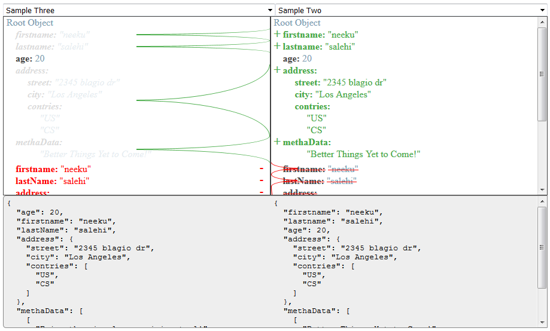

# Differentiate

Have you ever needed to compare two JSON objects and make a determination on what is changed deep in the object hierarchy and be able to
see any change on either objects on the fly as the change occurs?

## How it can be done?

Run `npm install differentiate` in your application. and do the following:

in your html:

	<differentiate 
		[leftSideObject]="leftJSONtree" 
		[rightSideObject]="rightJSONtree"></differentiate>

both leftJSONtree and rightJSONtree would be initiated in your component and could be updated at any time which would result in immediate differentiation on differentiate component.

In your App module

	import { BrowserModule } from '@angular/platform-browser';
	import { NgModule } from '@angular/core';
	import { DifferentiateModule } from 'differentiate';

	import { AppComponent } from './app.component';

	@NgModule({
	  declarations: [
		AppComponent
	  ],
	  imports: [
		BrowserModule,
		DifferentiateModule
	  ],
	  providers: [
	  ],
	  bootstrap: [AppComponent]
	})
	export class AppModule { }

	...

Sample view of the component at work!
